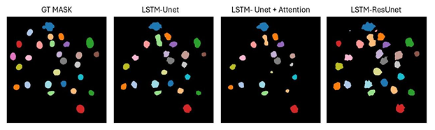
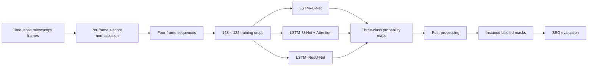
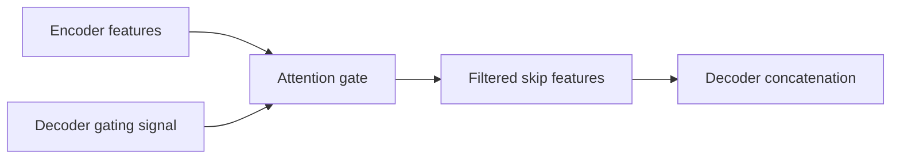
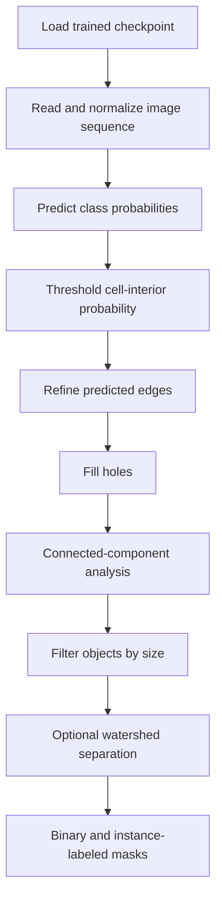

<div align="center">

# Spatiotemporal Cell Segmentation in Time-Lapse Microscopy

### Comparative evaluation of ConvLSTM–U-Net architectures with attention and residual learning

[](https://www.python.org/)
[](https://www.tensorflow.org/)
[](https://keras.io/)
[](#evaluation)
[](#dataset)
[](#limitations)

**A controlled comparison of three sequence-aware segmentation models for detecting and separating cells in fluorescence microscopy videos.**

[Overview](#overview) ·
[Architectures](#architectures) ·
[Dataset](#dataset) ·
[Results](#results) ·
[Getting Started](#getting-started) ·
[Limitations](#limitations)

</div>

---

## At a Glance

This repository investigates whether modifications to the **spatial feature-extraction component** of a ConvLSTM–U-Net improve cell segmentation in time-lapse fluorescence microscopy.

Three architectures were trained under the same proof-of-concept conditions:

| Model | Core idea | Mean SEG |
|---|---|---:|
| **LSTM–U-Net** | Baseline encoder–decoder with ConvLSTM temporal modeling | 0.5062 |
| **LSTM–U-Net + Attention** | Attention gates filter skip-connection features | 0.5171 |
| **LSTM–ResU-Net** | Residual blocks replace standard convolution blocks | **0.5607** |

> **Main result:** under the selected experimental setup, **LSTM–ResU-Net achieved the highest mean SEG score** and detected more faint cell instances. The attention model produced smoother boundaries but missed some low-contrast cells.

---

## Example Segmentation Output

<p align="center">
  
</p>

<p align="center">
  <em>
    Ground-truth instance mask compared with predictions from the baseline,
    attention-based, and residual architectures. Each color represents a
    separate cell instance.
  </em>
</p>

---

## Overview

Segmenting cells across time is more difficult than segmenting isolated images. Cells may:

- move between frames;
- change shape and intensity;
- overlap or touch neighboring cells;
- enter or leave the field of view;
- appear with weak contrast or unclear boundaries;
- be incorrectly merged into a single predicted object.

A frame-independent model does not explicitly preserve information from previous observations. This project therefore combines:

- **U-Net**, for multi-scale spatial feature extraction and mask reconstruction;
- **ConvLSTM**, for learning temporal relationships between consecutive microscopy frames.

The experiment focuses on a specific research question:

> Does improving the U-Net spatial pathway with attention gates or residual blocks improve temporal cell segmentation when the ConvLSTM component is kept conceptually consistent?

---

## Experimental Workflow



---

## Architectures

### 1. LSTM–U-Net Baseline

**File:** `lstm_u_net_baseline.py`

The baseline uses a U-shaped encoder–decoder network with skip connections and ConvLSTM-based temporal feature extraction.

```text
Input sequence
      │
      ▼
Multi-scale encoder
      │
      ▼
ConvLSTM temporal representation
      │
      ▼
Decoder + skip connections
      │
      ▼
Three-class segmentation map
```

Main components:

- hierarchical encoder–decoder structure;
- ConvLSTM layers for temporal context;
- standard encoder-to-decoder skip connections;
- batch normalization;
- Leaky ReLU activation;
- bilinear upsampling;
- three-class softmax output.

---

### 2. LSTM–U-Net with Attention

**File:** `lstm_u_net_+_attention.py`

This model adds an attention gate to each skip connection. The gate uses encoder features and a decoder-side gating signal to determine which spatial regions should contribute to reconstruction.



The attention mechanism is intended to:

- emphasize relevant cell regions;
- suppress background activations;
- reduce false-positive detections;
- improve boundaries in crowded scenes;
- focus decoder reconstruction on informative features.

The temporal ConvLSTM component remains conceptually aligned with the baseline to support a focused comparison.

---

### 3. LSTM–ResU-Net

**File:** `lstm_resunet.py`

This architecture replaces standard convolution blocks with residual blocks.

```text
Input ────────────────┐
  │                   │
  ▼                   │
Conv → Norm → Act → Conv
  │                   │
  └──────── Add ◄─────┘
              │
              ▼
           Output
```

Residual connections are intended to:

- improve gradient and information flow;
- preserve fine structures and thin boundaries;
- reduce excessive smoothing;
- support deeper feature extraction;
- improve the detection of faint cells;
- retain useful low-level information.

---

## Architecture Comparison

| Property | LSTM–U-Net | + Attention | ResU-Net |
|---|:---:|:---:|:---:|
| ConvLSTM temporal modeling | ✓ | ✓ | ✓ |
| U-shaped encoder–decoder | ✓ | ✓ | ✓ |
| Standard skip connections | ✓ | Filtered | ✓ |
| Attention gates | — | ✓ | — |
| Residual blocks | — | — | ✓ |
| Three-class softmax output | ✓ | ✓ | ✓ |
| Primary expected benefit | Baseline balance | Spatial focus | Feature preservation |

---

## Dataset

The project uses the **Fluo-N2DH-GOWT1** dataset from the
[Cell Tracking Challenge](https://celltrackingchallenge.net/2d-datasets/).

The sequence contains fluorescence microscopy images of GFP-GOWT1 mouse stem cells together with corresponding segmentation annotations.

Only this dataset was used in the current proof-of-concept experiment.

### Temporal Split

The frames were divided into temporally continuous, non-overlapping subsets:

| Subset | Frames |
|---|---:|
| Training | 92 |
| Validation | 72 |
| Test | 20 |

Maintaining separate contiguous time ranges reduces direct temporal leakage between training, validation, and test data.

---

## Preprocessing and Augmentation

### Normalization

Each frame is normalized independently using z-score normalization:

```math
x_{\mathrm{norm}} = \frac{x-\mu_x}{\sigma_x}
```

where:

- \(x\) is the original frame;
- \(\mu_x\) is its mean intensity;
- \(\sigma_x\) is its intensity standard deviation.

### Sequence Construction

Each model input contains:

```text
4 consecutive frames × 128 × 128 pixels
```

Depending on the selected data format, tensors may be represented as:

```text
NCHW: [batch, time, channels, height, width]
NHWC: [batch, time, height, width, channels]
```

### Training Augmentation

Spatial augmentation:

- random crops;
- horizontal and vertical flips;
- rotations in multiples of 90°;
- elastic deformation;
- affine transformations;
- random brightness adjustment;
- random contrast adjustment.

Temporal augmentation:

- reversal of frame order;
- temporal subsampling.

Augmentation is applied only to the training data.

---

## Model Output

The network predicts one class per pixel:

| Class | Meaning |
|---:|---|
| 0 | Background |
| 1 | Cell interior |
| 2 | Cell contour / boundary |

The contour class helps the post-processing pipeline distinguish adjacent cells that would otherwise be merged.

---

## Training Configuration

All architectures were evaluated under the same general setup:

| Parameter | Value |
|---|---|
| Optimizer | Adam |
| Learning rate | `1e-5` |
| Batch size | 5 |
| Sequence length | 4 frames |
| Crop size | `128 × 128` |
| Training iterations | 1,000 |
| Validation interval | Every 100 iterations |
| Output classes | Background, cell interior, contour |

The shorter training schedule was selected for a controlled proof-of-concept comparison under limited computational resources. The results should therefore not be interpreted as fully optimized benchmark performance.

---

## Loss Function

Training uses **weighted categorical cross-entropy**.

Class weights reduce the dominance of background pixels and allow greater importance to be assigned to cell interiors and boundaries.

Conceptually:

```math
\mathcal{L}
=
-\frac{1}{N}
\sum_{i=1}^{N}
m_i\,w_{y_i}\,
\log p_{i,y_i}
```

where:

- \(p_{i,y_i}\) is the predicted probability of the correct class;
- \(w_{y_i}\) is the weight of that class;
- \(m_i\) excludes invalid or unlabeled pixels;
- \(N\) is the number of valid pixels.

---

## Inference and Post-processing

The inference pipeline converts softmax predictions into instance-labeled cell masks.



Available operations include:

- probability thresholding;
- edge refinement;
- binary hole filling;
- connected-component labeling;
- small-object removal;
- object-size filtering;
- optional watershed-based separation;
- color-coded instance visualization.

---

## Evaluation

The primary metric is the **SEG score**, an instance-level segmentation measure used in cell-tracking evaluation.

The metric considers:

1. whether a ground-truth cell is detected;
2. whether a predicted component overlaps it sufficiently;
3. the intersection-over-union between the matched ground-truth and prediction masks.

A score closer to **1.0** indicates stronger instance-segmentation performance.

---

## Results

### Quantitative Comparison

| Rank | Architecture | Mean SEG | Difference from baseline |
|---:|---|---:|---:|
| 1 | **LSTM–ResU-Net** | **0.5607** | **+0.0545** |
| 2 | LSTM–U-Net + Attention | 0.5171 | +0.0109 |
| 3 | LSTM–U-Net baseline | 0.5062 | — |

### Relative Improvement

Compared with the baseline:

- attention improved mean SEG by approximately **2.2%**;
- residual learning improved mean SEG by approximately **10.8%**.

These percentages describe the reported experiment only and should not be generalized beyond the current dataset and training configuration.

---

## Qualitative Findings

### LSTM–U-Net

- detected a moderate number of cell instances;
- offered a reasonable balance between detection and boundary quality;
- did not consistently reproduce smooth or precise contours.

### LSTM–U-Net + Attention

- slightly improved the quantitative score;
- generated smoother masks and more precise boundaries;
- sometimes suppressed weak cells along with background features;
- detected fewer low-contrast instances.

### LSTM–ResU-Net

- achieved the highest mean SEG score;
- detected the largest number of cells;
- recovered more faint instances;
- occasionally produced distorted object shapes;
- still required improved boundary refinement.

### Shared Failure Mode

All three models sometimes merged two closely positioned cells into a single predicted component.

---

## Interpretation

The comparison suggests that the spatial architecture meaningfully affects the performance of a temporally aware segmentation model.

Under the selected conditions:

- **attention** improved spatial selectivity and boundary smoothness;
- **residual learning** preserved more detectable cell information and improved sensitivity to faint objects;
- the **residual model** produced the best overall SEG result;
- no architecture fully solved separation of touching cells.

Because the experiment uses a small, homogeneous dataset and only 1,000 training iterations, the results represent a **proof of concept**, not a definitive architecture ranking.

---

## Repository Structure

```text
DL_Medical_Image_Analysis/
├── README.md
├── lstm_u_net_baseline.py
├── lstm_u_net_+_attention.py
├── lstm_resunet.py
└── images/
    └── segmentation_comparison.png
```

The three Python files preserve complete experiment workflows exported from Google Colab, including model definitions, data handling, losses, training, inference, and post-processing sections.

---

## Getting Started

### Clone the Repository

```bash
git clone https://github.com/RoniDavidov56/DL_Medical_Image_Analysis.git
cd DL_Medical_Image_Analysis
```

### Create an Environment

```bash
python -m venv .venv
```

Windows:

```bash
.venv\Scripts\activate
```

Linux or macOS:

```bash
source .venv/bin/activate
```

### Install the Main Dependencies

```bash
pip install tensorflow numpy opencv-python scipy pillow \
    scikit-image matplotlib pandas tifffile tqdm imagecodecs requests
```

For GPU execution, the TensorFlow, CUDA, cuDNN, and driver versions must be mutually compatible.

---

## Important: Colab Export Structure

The current `.py` files were exported from Google Colab notebooks.

They contain sections that originally generated separate modules such as:

```text
Networks.py
Network_Res.py
DataHandeling.py
Params.py
losses.py
utils.py
train2D.py
Inference2D.py
ColorMarks.py
```

Some blocks remain commented because the notebooks used commands such as:

```python
%%writefile Networks.py
```

The exports may also contain notebook shell commands such as:

```python
!python train2D.py
!pip install imagecodecs
```

These commands are valid in Colab or Jupyter, but not in a conventional standalone Python script.

### Recommended Execution Path

1. Open the selected model file in Google Colab.
2. Restore or execute the relevant `%%writefile` sections.
3. Confirm dataset and output paths.
4. Install the required packages.
5. Generate the modular Python files.
6. Run the training script.
7. Run inference using the saved checkpoint.
8. Evaluate the generated masks with the SEG implementation.

The repository currently serves primarily as:

- an experiment record;
- an architecture reference;
- a reproducible Colab workflow;
- a basis for future modular refactoring.

---

## Recommended Modular Structure

A future production-style version could be organized as:

```text
project/
├── configs/
│   └── experiment.yaml
├── models/
│   ├── lstm_unet.py
│   ├── lstm_attention_unet.py
│   └── lstm_resunet.py
├── data/
│   ├── readers.py
│   ├── preprocessing.py
│   └── augmentation.py
├── metrics/
│   └── seg.py
├── postprocessing/
│   └── instances.py
├── train.py
├── inference.py
├── evaluate.py
├── requirements.txt
└── README.md
```

---

## Reproducibility Checklist

For a fair architecture comparison, keep the following settings identical:

- training, validation, and test time ranges;
- random seed;
- normalization method;
- augmentation settings;
- crop size;
- sequence length;
- batch size;
- optimizer and learning rate;
- number of iterations;
- class weights;
- validation frequency;
- inference thresholds;
- object-size filtering;
- post-processing operations;
- SEG implementation.

Changes to inference thresholds or post-processing may significantly alter instance-level results even when the trained model remains unchanged.

---

## Limitations

- Only one relatively small and homogeneous dataset was evaluated.
- The models were trained for 1,000 iterations.
- The architectures were not exhaustively tuned.
- Several paths and parameters are hard-coded in the exported workflows.
- Touching cells may be merged into one predicted instance.
- The attention model may suppress weak cell signals.
- The residual model may produce irregular object shapes.
- Some SciPy namespace imports are deprecated.
- Stateful ConvLSTM layers require correct resetting between independent sequences.
- `NCHW` execution may require compatible GPU support; `NHWC` is generally safer on CPU.
- Results may vary when random seeds and deterministic operations are not fixed.

---

## Future Work

Potential extensions include:

- training for substantially more iterations;
- evaluating additional Cell Tracking Challenge datasets;
- performing systematic hyperparameter optimization;
- tuning class weights and probability thresholds;
- improving contour supervision;
- separating touching cells with stronger watershed or distance-map methods;
- combining residual blocks and attention gates;
- testing Dice, focal, Tversky, or compound losses;
- using multi-scale supervision;
- reporting repeated-run mean and standard deviation;
- refactoring the Colab exports into reusable modules;
- adding configuration files, tests, and automated evaluation.

---

## Responsible Use

This repository is intended for **research and educational use**.

It is a proof-of-concept cell-segmentation experiment and has not been validated for clinical diagnosis, treatment decisions, or deployment in a regulated medical environment.

---

## Attribution and License

Parts of the implementation preserve notices and workflow conventions from an earlier code base. Existing attribution notices should remain intact when the code is modified or redistributed.

No explicit repository license is currently specified. Before reuse or redistribution:

1. verify the license of the original implementation;
2. verify the terms of the Cell Tracking Challenge dataset;
3. add an appropriate `LICENSE` file to this repository.

---

<div align="center">

### Temporal context. Spatial precision. Instance-aware evaluation.

</div>
